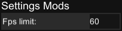
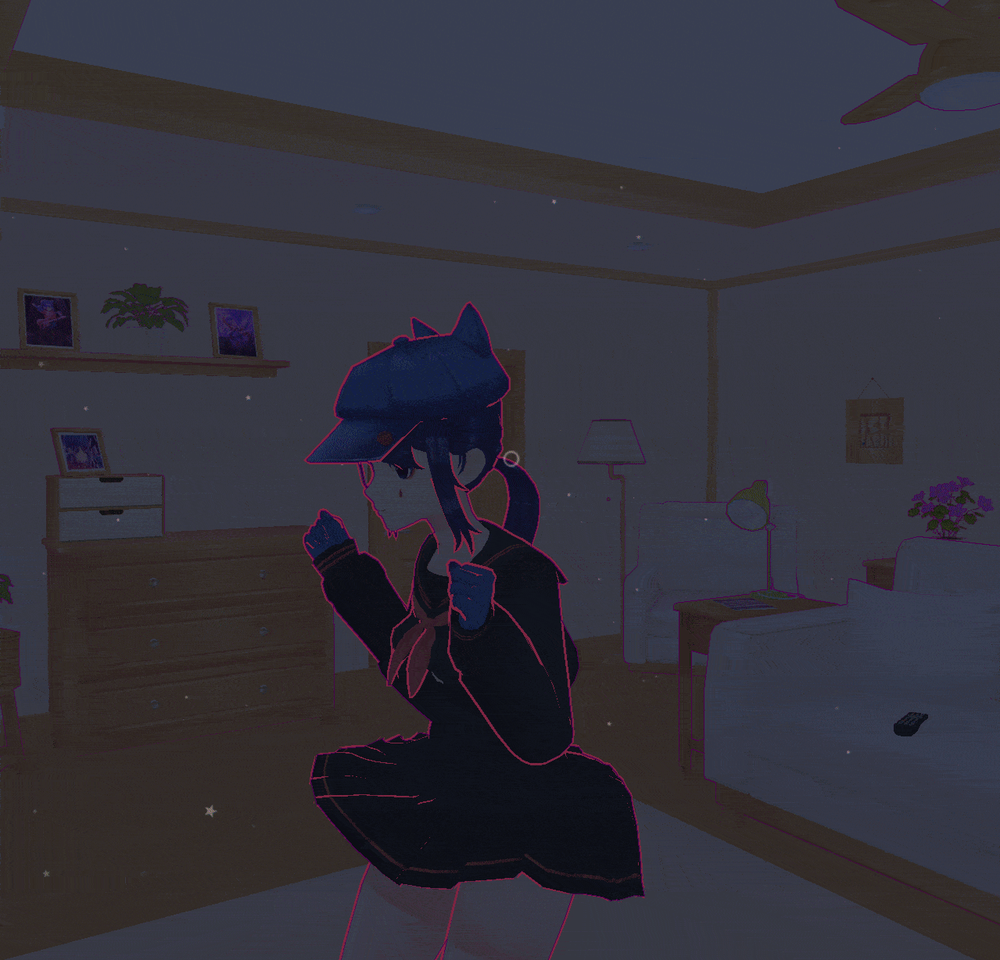
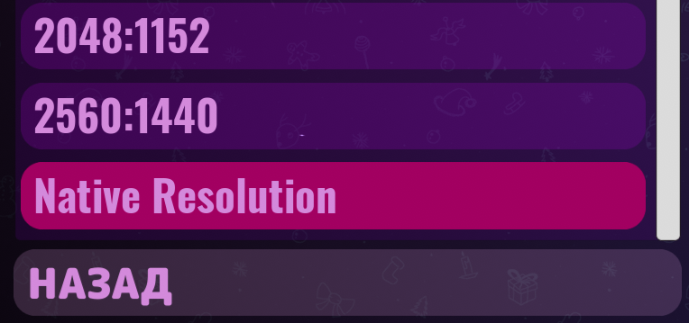

# _KappiMod_ pack for MiSide

## Table of contents

- [_KappiMod_ pack for MiSide](#kappimod-pack-for-miside)
  - [Table of contents](#table-of-contents)
  - [Information about modifications](#information-about-modifications)
    - [Supported mod loaders](#supported-mod-loaders)
    - [Mod list](#mod-list)
      - [Mod GUI](#mod-gui)
      - [Console unlocker](#console-unlocker)
      - [Flashlight increaser](#flashlight-increaser)
      - [Set FPS limit in GUI](#set-fps-limit-in-gui)
      - [Sit unlocker](#sit-unlocker)
      - [Sprint unlocker](#sprint-unlocker)
      - [Time scale scroller](#time-scale-scroller)
      - [Next mode](#next-mode)
    - [Patch list](#patch-list)
      - [Intro skipper](#intro-skipper)
      - [Native resolution option](#native-resolution-option)
  - [Mod pack installation](#mod-pack-installation)
  - [Key bindings](#key-bindings)
  - [For developers](#for-developers)
- [_KappiMod_ пак для MiSide (Russian)](#kappimod-пак-для-miside-russian)
  - [Информация о модификациях](#информация-о-модификациях)
    - [Поддерживаемые загрузчики модов](#поддерживаемые-загрузчики-модов)
    - [Список модификаций](#список-модификаций)
      - [GUI мода](#gui-мода)
      - [Разблокировка консоли](#разблокировка-консоли)
      - [Увеличение мощности фонарика](#увеличение-мощности-фонарика)
      - [Установка FPS лимита в GUI](#установка-fps-лимита-в-gui)
      - [Разблокировка приседания](#разблокировка-приседания)
      - [Разблокировка спринта](#разблокировка-спринта)
      - [Скроллер time scale](#скроллер-time-scale)
      - [Следующий мод](#следующий-мод)
    - [Список патчей](#список-патчей)
      - [Пропуск интро](#пропуск-интро)
      - [Нативное разрешение в настройках](#нативное-разрешение-в-настройках)
  - [Установка мод пака](#установка-мод-пака)
  - [Назначение клавиш](#назначение-клавиш)

## Information about modifications

Latest version of the mod pack is available [here](https://github.com/MrSago/MiSide-KappiMod/releases/latest).

### Supported mod loaders

| Mod loader  | Supported |
| :---------: | :-------: |
|   BepInEx   |    ✅     |
| MelonLoader |    ✅     |

### Mod list

#### Mod GUI

Opens by F1 key.

> _Note: the installed settings in the GUI of the mod are saved!_

#### Console unlocker

Unlocks in-game console by holding ~ key.

#### Flashlight increaser

Increases the range and radius of the flashlight by the **F** key. Pressing it again returns the original state.

  
Flashlight preview (May contains spoilers!)

    

#### Set FPS limit in GUI

  
FPS limit preview.

    

#### Sit unlocker

Unlocks the ability to sit down with the LCtrl (left control) key.

  
Sit preview (May contains spoilers!)

    

#### Sprint unlocker

Unlocks sprint mode by holding the Shift key.

#### Time scale scroller

Hold Left Shift and scroll mouse wheel for changing time scale.

#### Next mode

❓

### Patch list

#### Intro skipper

Automatically skips intro and cutscene when starting the game. Enabled in the GUI (F1 key).

#### Native resolution option

  
Option preview

    

Adds an option in the settings with native resolution with the maximum monitor resolution and maximum frequency. You can find this option in the resolution list with the name "Native Resolution" (see the preview section).

## Mod pack installation

- Install one of the supported mod loaders **(I recommend install BepInEx)**:

  - [BepInEx](https://github.com/BepInEx/BepInEx/releases)
    - We need **BepInEx-Unity.IL2CPP-win-x64-6.x.x** (6th version)
    - Unzip the contents of the archive into the game folder
  - [MelonLoader](https://github.com/LavaGang/MelonLoader/releases)
    - Just use the latest version **installer**

- Download [the latest version of the mod](https://github.com/MrSago/MiSide-KappiMod/releases/latest) for **the required loader**:

  - KappiMod.BepInEx.zip - for the BepInEx
  - KappiMod.MelonLoader.zip - for the MelonLoader

- Extract files from the archive into the game folder

- Have fun

## Key bindings

|            Key             |                 Action                  |
| :------------------------: | :-------------------------------------: |
|             F1             |              Open mod GUI               |
|        **~** (hold)        |          Open in game console           |
|             F              | Increase flashlight distance and radius |
|           LShift           |                 Sprint                  |
|           LCtrl            |                Sit down                 |
|  LShift + Mouse wheel up   |       Increase time scale by 0.1        |
| LShift + Mouse wheel down  |       Decrease time scale by 0.1        |
| LShift + Mouse wheel click |    Switch time scale between 0 and 1    |

## For developers

_Soon..._

---

# _KappiMod_ пак для MiSide (Russian)

## Информация о модификациях

Последняя версия мод пака доступна [здесь](https://github.com/MrSago/MiSide-KappiMod/releases/latest).

### Поддерживаемые загрузчики модов

|  Загрузчик  | Поддержка |
| :---------: | :-------: |
| MelonLoader |    ✅     |
|   BepInEx   |    ✅     |

### Список модификаций

#### GUI мода

Открывается по клавише F1.

> _Установленные настройки в GUI мода сохраняются!_

#### Разблокировка консоли

Разблокирует внутриигровую консоль при удержании клавиши ~ (русская Ё)

#### Увеличение мощности фонарика

Увеличивает дальность и радиус освещения фонарика нажатием клавиши **F**. Повторное нажатие возвращает исходное состояние.

  
Превью мода (Может содержать спойлеры!)

    

#### Установка FPS лимита в GUI

  
Превью настройки в меню мода

    

#### Разблокировка приседания

Разблокирует возможность приседать на клавишу LCtrl (левый контрол).

  
Превью приседания (Может содержать спойлеры!)

    

#### Разблокировка спринта

Разблокирует режим спринта на клавишу Shift.

#### Скроллер time scale

Зажмите левый Shift и прокрутите колесико мыши чтобы изменить time scale.

#### Следующий мод

❓

### Список патчей

#### Пропуск интро

Автоматически пропускает интро и катсцену при старте игры Пропуск диалогов включается в GUI (клавиша F1).

#### Нативное разрешение в настройках

  
Опция с нативным разрешением

    

Добавляет опцию в настройках с нативным разрешением, то есть с маскимальным разрешением монитора и максимальной частотой. Найти опцию можно в списке разрешений с названием "Native Resolution" (см. раздел Preview).

## Установка мод пака

- Установить один из поддерживаемых загрузчиков **(я рекомендую поставить BepInEx)**:

  - [BepInEx](https://github.com/BepInEx/BepInEx/releases)
    - Нам нужен **BepInEx-Unity.IL2CPP-win-x64-6.x.x** (6-ая версия)
    - Распакуйте содержимое архива в папку с игрой
  - [MelonLoader](https://github.com/LavaGang/MelonLoader/releases)
    - Просто используйте **установщик** последней версии

- Скачать [последнюю версию мода](https://github.com/MrSago/MiSide-KappiMod/releases/latest) **под нужный загрузчик:**

  - KappiMod.BepInEx.zip - для BepInEx
  - KappiMod.MelonLoader.zip - для MelonLoader

- Извлечь файлы из архива в папку с игрой

- Веселитесь

## Назначение клавиш

|           Клавиша            |               Действие                |
| :--------------------------: | :-----------------------------------: |
|              F1              |           Открыть GUI мода            |
|     **~** (удерживание)      |     Открыть внутриигровую консоль     |
|              F               | Увеличить дальность и радиус фонарика |
|            LShift            |                  Бег                  |
|            LCtrl             |              Приседание               |
| LShift + Колесико мыши вверх |      Увеличить time scale на 0.1      |
| LShift + Колесико мыши вниз  |      Уменьшить time scale на 0.1      |
| LShift + Клик колесика мыши  |  Переключить time scale между 0 и 1   |
